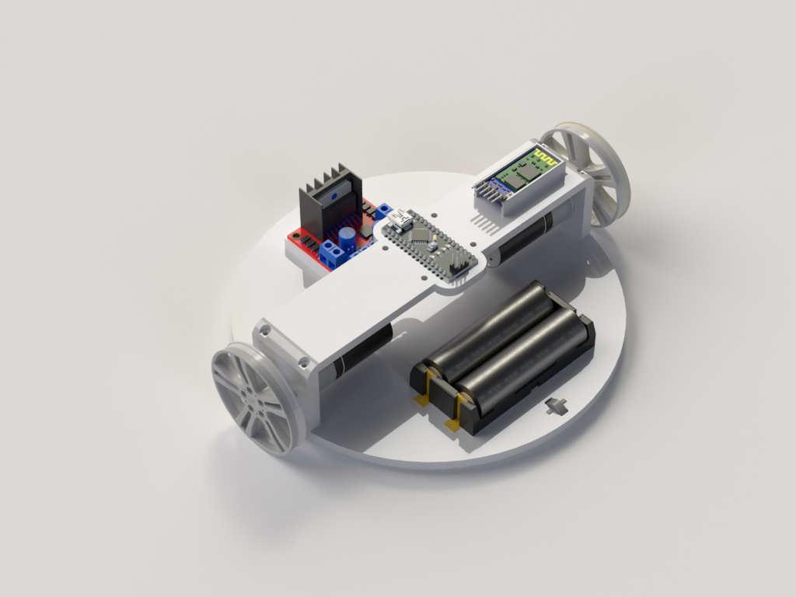
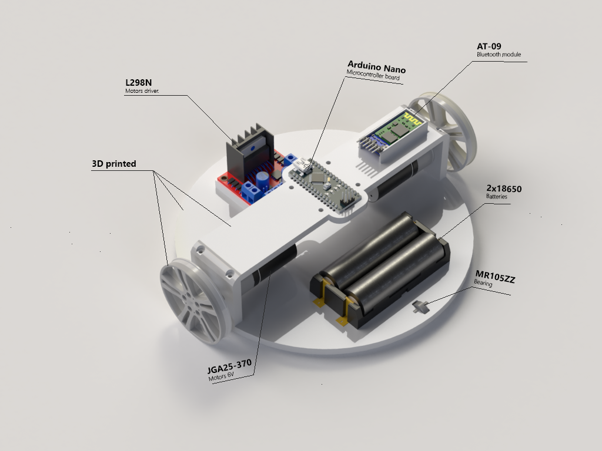
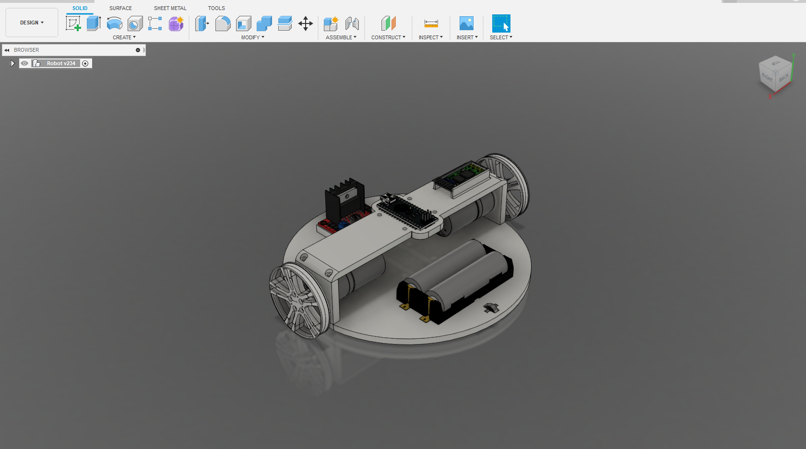
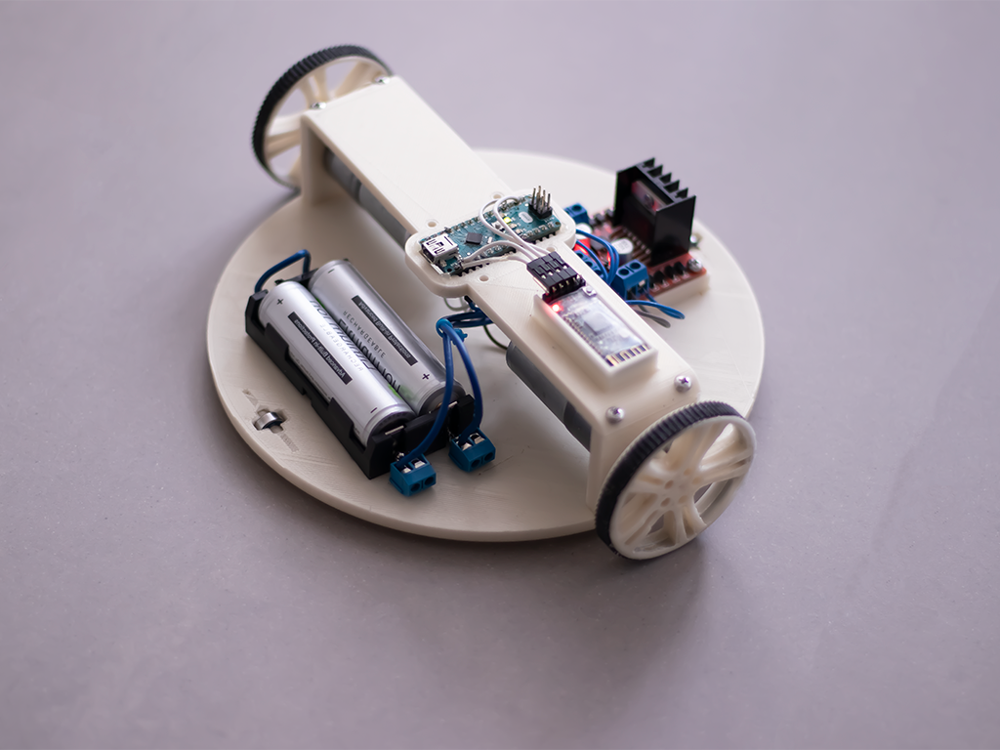

# 3D Printed Robot

The goal is to make a little bluetooth commanded robot over a Ionic mobile application.

## Parts

## Result

### Robot

### Mobile application

## **Documentation in Progress**

