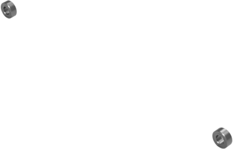

# 3D Printed Robot

The goal is to make a little bluetooth robot commanded with a mobile application.

## Result

### Robot

### Mobile application

*WIP: The app should and will be modified or changed by any other app already in Play/App store, the code has to be changed accordingly in Arduino nano*

## Parts and prices

## Price: less than 35$ (shipping costs included)

Components have been chosen with 2 main parameters:

- **Best vendor** rating (only vendors equal or above 98% of positive feedback have been chosen)
- **Lowest price** found, including shipping cost

|                           Product                            | Name                                                     | Quantity |    Price in $    |                                         Get Product | Comment                                                      |
| :----------------------------------------------------------: | -------------------------------------------------------- | :------: | :--------------: | --------------------------------------------------: | ------------------------------------------------------------ |
|  | L298N  Motors driver                                |    1     |       1.55       | [**Get**](https://s.click.aliexpress.com/e/_AUgiWD) |                                                              |
|  | Arduino Nano Microcontroller                        |    1     |       2.47       | [**Get**](https://s.click.aliexpress.com/e/_An73jR) |                                                              |
|  | 18650 battery holder                                     |    1     |        2         | [**Get**](https://s.click.aliexpress.com/e/_9RttAp) |                                                              |
|  | AT-09 Bluetooth module                              |    1     |       1.63       | [**Get**](https://s.click.aliexpress.com/e/_A9LxwV) |                                                              |
|                                                              | Dupont wire  (*Female VS Female*, *10cm*, *10 pin*) |    1     |       0.54       | [**Get**](https://s.click.aliexpress.com/e/_98ks45) | Used to connect  AT-09 and L298N  with Arduino Nano pins |
|                                                              | Dupont wire  (*Male VS Male*, *10cm*, *10 pin*)     |    1     |       0.74       | [**Get**](https://s.click.aliexpress.com/e/_98ks45) | Used to connect motors and battery pins with L298N      |
|  | GT2-6mm belt                                             |    1     |       0.69       | [**Get**](https://s.click.aliexpress.com/e/_Acf6TL) |                                                              |
|  | M3x12 Bolts                                              |    1     |       2.08       | [**Get**](https://s.click.aliexpress.com/e/_9yCjq9) |                                                              |
|  | JGA25-370 motors                                         |    2     |        7         | [**Get**](https://s.click.aliexpress.com/e/_AeoSBF) |                                                              |
|  | 18650 LiitoKala 3500 mAh 3.7v (*2pcs*)              |    2     |       5.97       | [**Get**](https://s.click.aliexpress.com/e/_9xaDaV) |                                                              |
|  | MR105ZZ Bearings                                         |    1     |       3.10       | [**Get**](https://s.click.aliexpress.com/e/_AVCCDX) | Bearing to make the robot be flat on the floor,  this is **optional**  but is recommended so  robot doesn't lean on front or back |
|                                                              | **Total**                                                |  **13**  |    **27.77**     |                                                     | Equals to ~: - 25.40 CHF - 23.50 €                 |
|                                                              | Shipping cost                                            |          |        7         |                                                     | Shipping cost is **approximatively ~$7**  (to Switzerland),  since this depends in which country you are, it could differ. |
|                                                              | **<u>Total with shipping</u>**                           |          | **<u>34.77</u>** |                                                     | Equals to ~: - 31.40 CHF - 29.44 €                 |

# Documentation

## Printing 3D parts

Find parts to print in [Parts folder](Parts), they are already classified, print them with recommended printing settings below.

Default recommended printing settings are these:

- `Layer height`: `0.2 mm` 

- `Infill`: `50%`

- `Support`: `No`

- `Build plate adhesion`: `Brim`

- `Nozzle`: `0.4 mm`

  

| Picture of STL file                                          | Name                                                         |                   Other printing settings                    | Number of prints |
| ------------------------------------------------------------ | :----------------------------------------------------------- | :----------------------------------------------------------: | :--------------: |
|   |  [**01_Main_Bottom_Part.stl**](Parts/01_Main_Bottom_Part.stl) |                            -                            |      1      |
|    |  [**02_Pillar_For_Motor.stl**](Parts/02_Pillar_For_Motor.stl) |                            -                            |      2      |
|    |  [**03_Top_Part.stl**](Parts/03_Top_Part.stl)           |                            -                            |      1      |
|    |  [**04_Wheel_IN_Part.stl**](Parts/04_Wheel_IN_Part.stl) |                            -                            |      2      |
|    |  [**05_Wheel_OUT_Part.stl**](Parts/05_Wheel_OUT_Part.stl) |  `Layer height`: `0.05 mm` or if not possible: `0.1 mm` |      2      |
|    |  [**06_L298N_bottom.stl**](Parts/06_L298N_bottom.stl)   |                            -                            |      1      |
|    |  [**07_Bearing_Maintainer_Under.stl**](Parts/07_Bearing_Maintainer_Under.stl) |  `Layer height`: `0.05 mm` or if not possible: `0.1 mm` |      4      |

## After printing, before final assembly

