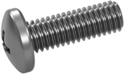

# 3D Printed Robot

The goal is to make a little bluetooth commanded robot over a Ionic mobile application.

## Parts and prices

## Price of this robot is less than 35$ (shipping cost included)

Pieces have been chosen with 2 main parameters:

- **Best vendor** rating (only vendors equal or above 98% of positive feedback have been used)
- **Lowest price** found, including shipping cost

|                           Product                            | Name                                                     | Quantity |    Price in $    |                                         Get Product | Comment                                                      |
| :----------------------------------------------------------: | -------------------------------------------------------- | :------: | :--------------: | --------------------------------------------------: | ------------------------------------------------------------ |
|  | L298N  Motors driver                                |    1     |       1.55       | [**Get**](https://s.click.aliexpress.com/e/_AUgiWD) |                                                              |
|  | Arduino Nano Microcontroller                        |    1     |       2.47       | [**Get**](https://s.click.aliexpress.com/e/_An73jR) |                                                              |
|  | 18650 battery holder                                     |    1     |        2         | [**Get**](https://s.click.aliexpress.com/e/_9RttAp) |                                                              |
|  | AT-09 Bluetooth module                              |    1     |       1.63       | [**Get**](https://s.click.aliexpress.com/e/_A9LxwV) |                                                              |
|                                                              | Dupont wire  (*Female VS Female*, *10cm*, *10 pin*) |    1     |       0.54       | [**Get**](https://s.click.aliexpress.com/e/_98ks45) | Used to connect  AT-09 and L298N  with Arduino Nano pins |
|                                                              | Dupont wire  (*Male VS Male*, *10cm*, *10 pin*)     |    1     |       0.74       | [**Get**](https://s.click.aliexpress.com/e/_98ks45) | Used to connect motors and battery pins with L298N      |
|  | GT2-6mm belt                                             |    1     |       0.69       | [**Get**](https://s.click.aliexpress.com/e/_Acf6TL) |                                                              |
|  | M3x12 Bolts                                              |    1     |       2.08       | [**Get**](https://s.click.aliexpress.com/e/_9yCjq9) |                                                              |
|  | JGA25-370 motors                                         |    2     |        7         | [**Get**](https://s.click.aliexpress.com/e/_AeoSBF) |                                                              |
|  | 18650 LiitoKala 3500 mAh 3.7v (*2pcs*)              |    2     |       5.97       | [**Get**](https://s.click.aliexpress.com/e/_9xaDaV) |                                                              |
|  | MR105ZZ Bearings                                         |    1     |       3.10       | [**Get**](https://s.click.aliexpress.com/e/_AVCCDX) | Bearing to make the robot be flat on the floor,  this is **optional**  but is recommended so  robot doesn't lean on front or back |
|                                                              | **Total**                                                |  **13**  |    **27.77**     |                                                     | Equals to ~: - 25.40 CHF - 23.50 €                 |
|                                                              | Shipping cost                                            |          |        7         |                                                     | Shipping cost is **approximatively ~$7**  (to Switzerland),  since this depends in which country you are, it could differ. |
|                                                              | **<u>Total with shipping</u>**                           |          | **<u>34.77</u>** |                                                     | Equals to ~: - 31.40 CHF - 29.44 €                 |

## Result

### Robot

### Mobile application

## **Documentation in Progress**

